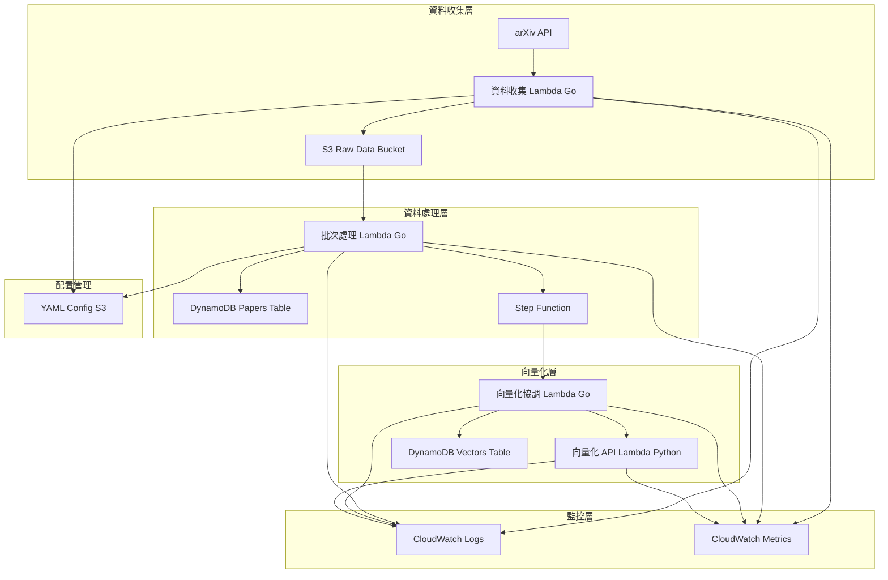

# 設計文件

## 概述

本系統是一個基於 AWS 雲端服務的學術論文資料處理管線，採用 serverless 架構設計。系統主要由四個核心服務組成：資料收集服務、批次處理服務、向量化服務和監控服務。

## 架構

### 系統架構圖



### 服務流程

1. **資料收集階段**: 每日定時觸發資料收集 Lambda，從 arXiv API 獲取資料並壓縮存儲至 S3
2. **事件觸發階段**: S3 檔案上傳事件自動觸發批次處理 Lambda
3. **批次處理階段**: 批次處理 Lambda 解壓縮資料並執行去重、轉換、upsert 操作，完成後返回 traceID
4. **流程控制階段**: Step Function 接收 traceID 並觸發向量化流程
5. **向量化階段**: 向量化協調 Lambda (Go) 根據 traceID 獲取資料，調用向量化 API (Python) 生成 embedding，並存儲結果
6. **監控階段**: 各階段服務持續輸出結構化日誌和指標到 CloudWatch

## 元件與介面

### 1. 資料收集服務 (Go)

**職責**: 從外部 API 收集資料並壓縮存儲

**核心元件**:
- `DataCollector`: 主要收集邏輯
- `ConfigManager`: YAML 配置管理
- `S3Uploader`: S3 上傳功能
- `Logger`: 結構化日誌輸出

**介面設計**:
```go
type DataCollector interface {
    CollectData(ctx context.Context, config *Config) (*CollectionResult, error)
}

type ConfigManager interface {
    LoadConfig(ctx context.Context, s3Path string) (*Config, error)
}

type S3Uploader interface {
    UploadCompressed(ctx context.Context, data []byte, key string) error
}
```

### 統一 Logger 服務 (Go)

**職責**: 為所有 Go 服務提供統一的結構化日誌功能

**核心元件**:
- `Logger`: 統一的結構化日誌介面
- `LogEntry`: 標準化的日誌條目結構
- `ContextExtractor`: AWS Lambda context 資訊提取

**介面設計**:
```go
type Logger interface {
    WithContext(ctx context.Context) *Logger
    WithTraceID(traceID string) *Logger
    Info(message string, metadata ...map[string]interface{})
    InfoWithCount(message string, count int, metadata ...map[string]interface{})
    InfoWithDuration(message string, duration time.Duration, metadata ...map[string]interface{})
    Warn(message string, metadata ...map[string]interface{})
    Error(message string, err error, metadata ...map[string]interface{})
    Debug(message string, metadata ...map[string]interface{})
}

type LogEntry struct {
    Timestamp   string                 `json:"timestamp"`
    Level       LogLevel               `json:"level"`
    Message     string                 `json:"message"`
    Service     string                 `json:"service"`
    TraceID     string                 `json:"trace_id,omitempty"`
    RequestID   string                 `json:"request_id,omitempty"`
    Duration    *int64                 `json:"duration_ms,omitempty"`
    DataCount   *int                   `json:"data_count,omitempty"`
    Error       *ErrorDetails          `json:"error,omitempty"`
    Metadata    map[string]interface{} `json:"metadata,omitempty"`
}

type ErrorDetails struct {
    Type    string `json:"type"`
    Message string `json:"message"`
    Code    string `json:"code,omitempty"`
}
```

### 2. 批次處理服務 (Go)

**職責**: 處理 S3 壓縮資料，執行去重和 DynamoDB upsert，返回 traceID

**核心元件**:
- `BatchProcessor`: 批次處理邏輯
- `DataDeduplicator`: 資料去重
- `DynamoDBWriter`: DynamoDB 寫入操作
- `TraceManager`: traceID 生成和管理

**介面設計**:
```go
type BatchProcessor interface {
    ProcessS3File(ctx context.Context, s3Event S3Event) (*ProcessResult, error)
}

type DataDeduplicator interface {
    Deduplicate(records []Record) []Record
}

type DynamoDBWriter interface {
    BatchUpsert(ctx context.Context, records []Record) error
}

type ProcessResult struct {
    TraceID       string    `json:"trace_id"`
    ProcessedCount int      `json:"processed_count"`
    Timestamp     time.Time `json:"timestamp"`
    Status        string    `json:"status"`
}
```

### 3. 向量化協調服務 (Go)

**職責**: 根據 traceID 獲取需要向量化的資料，調用 Python API，存儲結果

**核心元件**:
- `VectorCoordinator`: 向量化協調邏輯
- `DataRetriever`: 根據 traceID 獲取資料
- `VectorAPIClient`: 調用 Python 向量化 API
- `VectorStorage`: 向量存儲管理

**介面設計**:
```go
type VectorCoordinator interface {
    ProcessByTraceID(ctx context.Context, traceID string) (*VectorResult, error)
}

type DataRetriever interface {
    GetPapersByTraceID(ctx context.Context, traceID string) ([]Paper, error)
}

type VectorAPIClient interface {
    GenerateEmbedding(ctx context.Context, text string) ([]float64, error)
}
```

### 4. 向量化 API 服務 (Python)

**職責**: 純粹的文字轉向量 API 服務

**核心元件**:
- `EmbeddingAPI`: API 端點處理
- `ModelManager`: Hugging Face 模型管理

**介面設計**:
```python
class EmbeddingAPI:
    def generate_embedding(self, text: str) -> List[float]
    
class ModelManager:
    def load_model(self) -> None
    def encode_text(self, text: str) -> List[float]
```

### 4. 監控服務

**職責**: 系統可觀測性和指標收集

**核心功能**:
- 結構化日誌輸出
- 自定義指標發送
- 錯誤追蹤和告警

## 資料模型

### DynamoDB Papers Table

```json
{
  "paper_id": "string (PK)",
  "source": "string (GSI PK, e.g., 'arxiv', 'pubmed')",
  "title": "string",
  "abstract": "string",
  "authors": ["string"],
  "published_date": "string (ISO 8601)",
  "categories": ["string"],
  "raw_xml": "string",
  "trace_id": "string (GSI)",
  "batch_timestamp": "string (ISO 8601)",
  "processing_status": "string",
  "created_at": "string (ISO 8601)",
  "updated_at": "string (ISO 8601)"
}
```

**GSI 設計**:
- **GSI-1**: `source` (PK) + `published_date` (SK) - 支援按來源和日期查詢
- **GSI-2**: `trace_id` (PK) + `batch_timestamp` (SK) - 支援批次處理追蹤

### DynamoDB Vectors Table

**主要結構**:
```json
{
  "paper_id": "string (PK)",
  "vector_type": "string (SK, e.g., 'title_abstract', 'full_text', 'conclusion')",
  "embedding": [float],
  "embedding_metadata": {
    "model_name": "string",
    "model_version": "string",
    "dimension": "number",
    "text_length": "number",
    "preprocessing": "string"
  },
  "source_text": {
    "content": "string",
    "source_fields": ["string"],
    "language": "string"
  },
  "processing_info": {
    "created_at": "string (ISO 8601)",
    "trace_id": "string",
    "processing_time_ms": "number"
  }
}
```

**GSI 設計**:
- **GSI-1**: `vector_type` (PK) + `created_at` (SK) - 支援按向量類型查詢
- **GSI-2**: `embedding_metadata.model_version` (PK) + `paper_id` (SK) - 支援模型版本管理

### S3 資料結構

**Raw Data Path**: `raw-data/YYYY-MM-DD/papers-{timestamp}.gz`
**Config Path**: `config/pipeline-config.yaml`

### Step Function 輸入/輸出格式

**批次處理 Lambda 輸出 (Step Function 輸入)**:
```json
{
  "trace_id": "string",
  "processed_count": "number",
  "timestamp": "string (ISO 8601)",
  "status": "string"
}
```

**向量化協調 Lambda 輸入**:
```json
{
  "trace_id": "string"
}
```

### 向量化 API 格式

**請求格式**:
```json
{
  "text": "string"
}
```

**回應格式**:
```json
{
  "embedding": [float],
  "model_version": "string"
}
```

## Logger 統一化策略

### 1. Logger 套件設計

**共享 Logger 套件**:
- 在 `go-services/shared/logger/` 目錄下建立統一的 logger 套件
- 所有 Go 服務透過 import 使用相同的 logger 實現
- 支援 AWS Lambda context 自動提取 request ID 和其他 metadata

**Logger 初始化**:
```go
// 在每個服務的 main.go 中
logger := logger.New("service-name")
contextLogger := logger.WithContext(ctx)
```

**Context 傳遞**:
- 在處理 Lambda 事件時，使用 `WithContext()` 方法建立 context-aware logger
- 在處理流程中傳遞 logger 實例，確保 trace ID 和 request ID 的一致性

### 2. 現有服務遷移策略

**batch-processor 遷移計劃**:
1. 將 data-collector 的 logger 套件移動到 shared 目錄
2. 更新 batch-processor 的 import 路徑使用 shared logger
3. 替換所有 `log.Printf` 調用為結構化 logger 方法
4. 更新 monitoring/logger.go 使用統一介面或移除重複功能
5. 確保所有錯誤處理使用 `logger.Error()` 方法

**其他 Go 服務適配**:
- 新建立的 Go 服務直接使用 shared logger
- 現有服務逐步遷移到統一 logger
- 保持向後相容性，避免破壞現有功能

### 3. Logger 配置管理

**環境變數支援**:
- `LOG_LEVEL`: 控制日誌輸出等級 (DEBUG, INFO, WARN, ERROR)
- `SERVICE_NAME`: 自動設定服務名稱（如果未在程式碼中指定）

**輸出格式**:
- 統一使用 JSON 格式輸出到 stdout
- CloudWatch Logs 自動收集並解析 JSON 結構
- 支援本地開發時的可讀格式（透過環境變數控制）

## 錯誤處理

### 1. 資料收集階段錯誤處理

- **API 請求失敗**: 實施指數退避重試機制，最多重試 3 次
- **S3 上傳失敗**: 記錄錯誤並觸發告警，支援手動重試
- **配置載入失敗**: 使用預設配置並記錄警告

### 資料來源擴充設計

**YAML 配置支援多來源**:
```yaml
data_sources:
  arxiv:
    api_endpoint: "http://export.arxiv.org/api/query"
    fields_mapping:
      id: "id"
      title: "title"
      abstract: "summary"
      authors: "author"
      published: "published"
      categories: "category"
    rate_limit: 3  # requests per second
    
  pubmed:
    api_endpoint: "https://eutils.ncbi.nlm.nih.gov/entrez/eutils/"
    fields_mapping:
      id: "pmid"
      title: "ArticleTitle"
      abstract: "AbstractText"
      authors: "AuthorList"
      published: "PubDate"
    rate_limit: 10
    
  # 未來可新增更多來源
  semantic_scholar:
    api_endpoint: "https://api.semanticscholar.org/graph/v1/"
    # ...
```

### 2. 批次處理階段錯誤處理

- **S3 事件處理失敗**: 實施 Lambda 重試機制，失敗事件進入 DLQ
- **S3 檔案讀取失敗**: 記錄錯誤並跳過該檔案，觸發告警
- **DynamoDB 寫入失敗**: 實施批次重試，失敗項目寫入 DLQ
- **資料格式錯誤**: 記錄無效記錄並繼續處理其他記錄

### 3. 向量化階段錯誤處理

- **模型載入失敗**: Lambda 冷啟動時預載入模型，失敗時觸發告警
- **向量生成失敗**: 記錄失敗項目並重新排隊處理
- **DynamoDB 寫入失敗**: 實施重試機制並記錄失敗項目

### 4. 通用錯誤處理策略

- 所有服務實施 Circuit Breaker 模式
- 使用 Dead Letter Queue (DLQ) 處理持續失敗的訊息
- 實施結構化錯誤日誌，包含錯誤碼、訊息和上下文資訊

## 測試策略

### 1. 單元測試

**Go 服務測試**:
- 使用 `testify` 框架進行單元測試
- Mock 外部依賴 (AWS SDK, HTTP 客戶端)
- 測試檔案與源碼放在同一目錄，命名為 `*_test.go`
- 每個功能實作完成後立即撰寫對應測試
- 測試覆蓋率目標: 80%

**Python 服務測試**:
- 使用 `pytest` 框架
- Mock Hugging Face 模型和 AWS 服務
- 測試檔案與源碼放在同一目錄，命名為 `test_*.py`
- 每個功能實作完成後立即撰寫對應測試
- 測試覆蓋率目標: 80%

### 2. 測試驅動開發流程

**每個任務的測試流程**:
1. 實作核心功能
2. 立即撰寫單元測試驗證功能正確性
3. 執行測試確保通過
4. 重構代碼並確保測試持續通過
5. 完成任務前再次執行完整測試套件

**測試檔案組織**:
- 測試檔案與被測試的源碼檔案放在同一目錄
- Go: `main.go` 對應 `main_test.go`
- Python: `api.py` 對應 `test_api.py`
- 避免建立獨立的 `tests/` 目錄，保持檔案就近原則

### 3. 整合測試

- 使用 LocalStack 模擬 AWS 服務
- 測試端到端資料流程
- 驗證 S3 事件觸發和 SQS 訊息處理
- 在每個服務完成後執行相關整合測試

### 4. 效能測試

- 模擬大量資料處理場景
- 測試 DynamoDB 批次寫入效能
- 驗證 Lambda 冷啟動時間和記憶體使用

### 5. 部署測試

- 使用 AWS CLI 進行自動化部署測試
- 驗證 IAM 權限配置
- 測試 CloudWatch 日誌和指標收集

## 部署架構

### 專案結構

```
pipeline-api-dynamodb/
├── go-services/
│   ├── shared/
│   │   └── logger/
│   │       ├── logger.go
│   │       ├── logger_test.go
│   │       └── types.go
│   ├── data-collector/
│   │   ├── main.go
│   │   ├── main_test.go
│   │   ├── collector/
│   │   │   ├── arxiv.go
│   │   │   ├── arxiv_test.go
│   │   │   ├── s3uploader.go
│   │   │   └── s3uploader_test.go
│   │   ├── config/
│   │   │   ├── config.go
│   │   │   └── config_test.go
│   │   └── Makefile
│   ├── batch-processor/
│   │   ├── main.go
│   │   ├── main_test.go
│   │   ├── processor/
│   │   │   ├── processor.go
│   │   │   └── processor_test.go
│   │   ├── dynamodb/
│   │   │   ├── writer.go
│   │   │   └── writer_test.go
│   │   └── Makefile
│   └── vector-coordinator/
│       ├── main.go
│       ├── main_test.go
│       ├── coordinator/
│       │   ├── coordinator.go
│       │   └── coordinator_test.go
│       ├── api_client/
│       │   ├── client.go
│       │   └── client_test.go
│       └── Makefile
├── python-services/
│   ├── embedding-api/
│   │   ├── main.py
│   │   ├── test_main.py
│   │   ├── api/
│   │   │   ├── endpoints.py
│   │   │   └── test_endpoints.py
│   │   ├── models/
│   │   │   ├── embedding.py
│   │   │   └── test_embedding.py
│   │   ├── requirements.txt
│   │   └── Makefile
├── infrastructure/
│   └── cloudformation/
├── config/
│   └── pipeline-config.yaml
├── Makefile (根目錄)
└── README.md
```

### 部署流程

1. **編譯階段**: 各服務獨立編譯為部署包
2. **打包階段**: 創建 Lambda 部署 ZIP 檔案
3. **部署階段**: 使用 AWS CLI 部署到指定環境
4. **權限配置**: 透過 AWS Console 手動配置 IAM 權限
5. **驗證階段**: 執行部署後測試確認服務正常

### 環境配置

- **開發環境**: 使用 LocalStack 進行本地開發
- **測試環境**: AWS 測試帳戶，資源使用最小配置
- **生產環境**: 完整 AWS 資源配置，啟用所有監控功能

### 資料庫擴充性設計

**水平擴充支援**:
- 使用 `source` 作為 GSI 分區鍵，支援多資料來源
- `vector_type` 支援不同類型的向量（標題+摘要、全文、結論等）
- `metadata` 和 `content` 使用巢狀結構，支援不同來源的欄位差異

**版本管理**:
- 向量表支援多模型版本並存
- 可根據模型版本進行批次更新或比較

**查詢最佳化**:
- 多個 GSI 支援不同查詢模式
- 分區鍵設計避免熱分區問題