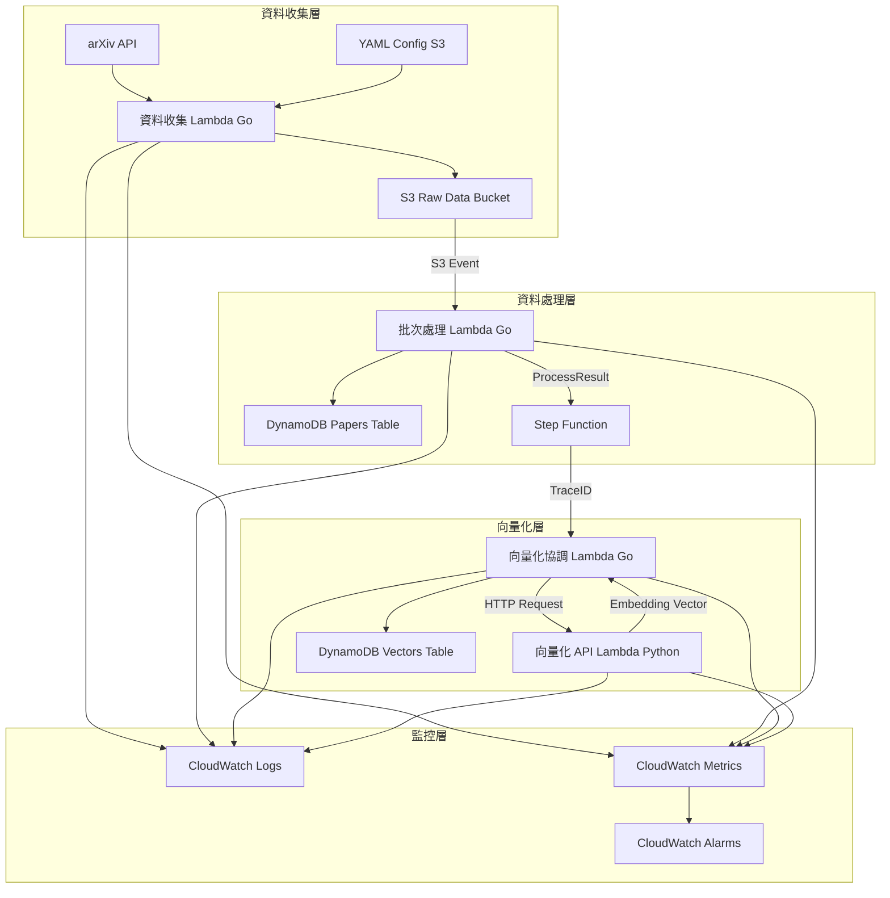
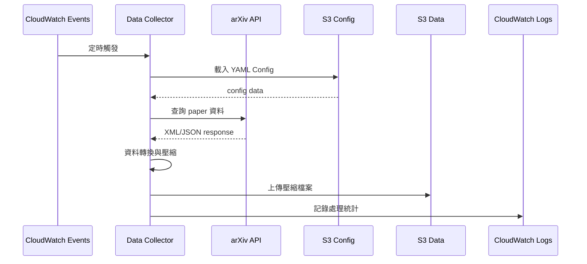
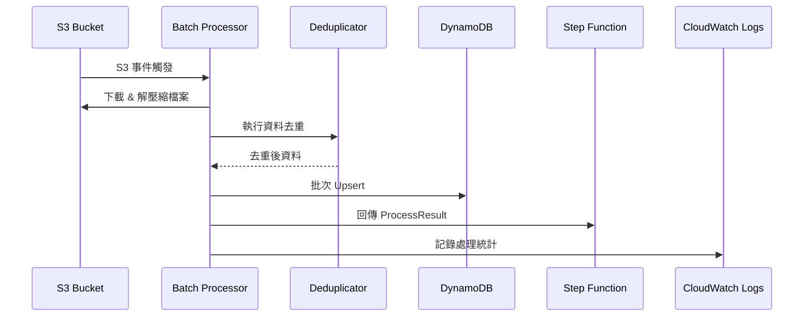
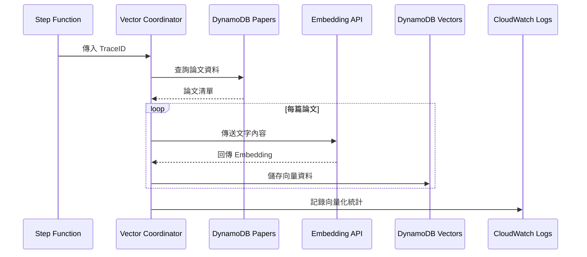

# Pipeline API DynamoDB

學術論文資料處理管線，支援從多個資料來源收集、處理、向量化論文資料的完整 serverless 架構。

## 系統架構

### 高層次系統流程圖



### 詳細模組作業流程圖

#### 1. 資料收集模組流程



#### 2. 批次處理模組流程



#### 3. 向量化模組流程



## 專案結構

```
pipeline-api-dynamodb/
├── go-services/                 # Go 微服務
│   ├── data-collector/         # 資料收集服務
│   ├── batch-processor/        # 批次處理服務
│   └── vector-coordinator/     # 向量化協調服務
├── python-services/            # Python 微服務
│   └── embedding-api/          # 向量化 API 服務
├── infrastructure/             # 基礎設施配置
│   └── cloudformation/         # CloudFormation 模板
├── config/                     # 配置檔案
│   └── pipeline-config.yaml    # 管線配置
├── Makefile                    # 根目錄建置腳本
└── README.md                   # 專案說明
```

## 快速開始

### 前置需求

- Go 1.23+
- Python 3.11+
- AWS CLI 配置完成
- Make 工具

### 本地開發

1. **建置所有服務**
   ```bash
   make build-all
   ```

2. **執行測試**
   ```bash
   make test-all
   ```

3. **本地測試執行**
   ```bash
   make local-test
   ```

### 部署到 AWS

#### 完整部署流程

1. **設定 AWS 認證**
   ```bash
   # 配置 AWS CLI
   aws configure
   
   # 或使用環境變數
   export AWS_ACCESS_KEY_ID=your_access_key
   export AWS_SECRET_ACCESS_KEY=your_secret_key
   export AWS_DEFAULT_REGION=us-east-1
   ```
2. **建置和測試**
   ```bash
   # 建置所有服務
   make build-all
   
   # 執行完整測試
   make test-all
   
   # 建立部署套件
   make package-all
   
   # 驗證套件完整性
   make verify-all
   ```

3. **部署服務**
   ```bash
   # 部署到預設環境 (dev)
   make deploy-all
   ```

#### 個別服務部署

```bash
# 部署特定服務
make data-collector TARGET=deploy
make batch-processor TARGET=deploy
make vector-coordinator TARGET=deploy
make embedding-api TARGET=deploy
```

## 服務說明

### 1. 資料收集服務 (Go) - `data-collector`

**功能概述**: 從多個學術資料來源收集論文資料並壓縮存儲

**輸入格式**:
```json
{
  "source": "arxiv",
  "date_range": {
    "start": "2024-01-01",
    "end": "2024-01-02"
  },
  "max_results": 1000
}
```

**輸出格式**:
```json
{
  "status": "success",
  "collected_count": 856,
  "s3_key": "raw-data/2024-01-01/papers-20240101120000.gz",
  "processing_time_ms": 45000
}
```

**主要功能**:
- 支援多資料來源 (目前只放了 arXiv)
- 自動資料格式轉換和標準化
- Gzip 壓縮減少存儲成本
- 結構化日誌和錯誤處理

### 2. 批次處理服務 (Go) - `batch-processor`

**功能概述**: 處理 S3 壓縮資料，執行去重和 DynamoDB upsert 操作

**輸入格式** (S3 Event):
```json
{
  "Records": [{
    "s3": {
      "bucket": {"name": "pipeline-raw-data"},
      "object": {"key": "raw-data/2024-01-01/papers-20240101120000.gz"}
    }
  }]
}
```

**輸出格式**:
```json
{
  "trace_id": "batch-20240101-abc123",
  "processed_count": 856,
  "duplicate_count": 23,
  "upsert_count": 833,
  "timestamp": "2024-01-01T12:30:00Z",
  "status": "completed"
}
```

**主要功能**:
- S3 檔案自動下載和解壓縮
- 基於 paper_id 的去重
- DynamoDB 批次 upsert 操作
- TraceID 生成用於流程追蹤

### 3. 向量化協調服務 (Go) - `vector-coordinator`

**功能概述**: 根據 TraceID 控制向量化流程，調用 Python API 生成 embedding

**輸入格式**:
```json
{
  "trace_id": "batch-20240101-abc123"
}
```

**輸出格式**:
```json
{
  "trace_id": "batch-20240101-abc123",
  "vectorized_count": 833,
  "failed_count": 0,
  "processing_time_ms": 120000,
  "status": "completed"
}
```

**主要功能**:
- 根據 TraceID 查詢待向量化 papers
- 調用 Python embedding API
- 向量結果批次存儲

### 4. 向量化 API 服務 (Python) - `embedding-api`

**功能概述**: 純粹的文字轉向量 API 服務，使用 Hugging Face 模型

**API 端點**:

#### POST `/embed`
**請求格式**:
```json
{
  "text": "Deep learning approaches for natural language processing",
  "model_version": "v1.0"
}
```

**回應格式**:
```json
{
  "embedding": [0.1234, -0.5678, ...],
  "dimension": 384,
  "model_name": "all-MiniLM-L6-v2",
  "model_version": "v1.0",
  "processing_time_ms": 150
}
```
**主要功能**:
- 預載入 Hugging Face 模型
- 文字預處理和標準化
- 高效能向量生成
- 模型版本管理

## 配置管理

系統使用 YAML 配置檔案支援多資料來源：

```yaml
data_sources:
  arxiv:
    api_endpoint: "http://export.arxiv.org/api/query"
    rate_limit: 3
    max_results: 1000
  
  pubmed:
    api_endpoint: "https://eutils.ncbi.nlm.nih.gov/entrez/eutils/"
    rate_limit: 10
    max_results: 1000
```

## 資料模型

### Papers Table
- **主鍵**: paper_id
- **GSI**: source + published_date, trace_id + batch_timestamp

### Vectors Table
- **主鍵**: paper_id + vector_type
- **GSI**: vector_type + created_at, model_version + paper_id

## 開發 guide

### 個別服務開發

```bash
# 資料收集服務
cd go-services/data-collector
make build
make test
make local-run

# 向量化 API 服務
cd python-services/embedding-api
make install
make test
make local-run
```

### 新增資料來源

1. 在 `config/pipeline-config.yaml` 新增資料來源配置
2. 實作對應的 API 客戶端
3. 更新欄位映射邏輯

## 監控與日誌

- **結構化日誌**: 所有服務輸出 JSON 格式日誌到 CloudWatch
- **指標監控**: 在 cloudwatch 上定義指標追蹤執行狀況
- **告警設定**: 針對單位時間內的錯誤率，以及大量寫入的資料給予謹告

# 擴展 Guide

#### 新增資料來源
1. 更新 `config/pipeline-config.yaml`
2. 實作新的 API client
3. 更新 data mapping logic
4. 執行測試 & 部署

#### 效能擴展
1. **水平擴展**: 增加 Lambda 並發限制，實作 goroutine 並發處理
2. **垂直擴展**: 調整記憶體和 CPU 配置

### 監控告警設定

#### CloudWatch 告警
```bash
# Lambda 錯誤率告警
aws cloudwatch put-metric-alarm \
  --alarm-name "Lambda-ErrorRate-High" \
  --alarm-description "Lambda error rate is too high" \
  --metric-name Errors \
  --namespace AWS/Lambda \
  --statistic Sum \
  --period 300 \
  --threshold 5 \
  --comparison-operator GreaterThanThreshold \
  --dimensions Name=FunctionName,Value=batch-processor

# DynamoDB 寫入容量告警
aws cloudwatch put-metric-alarm \
  --alarm-name "DynamoDB-WriteCapacity-High" \
  --alarm-description "DynamoDB write capacity usage is high" \
  --metric-name ConsumedWriteCapacityUnits \
  --namespace AWS/DynamoDB \
  --statistic Sum \
  --period 300 \
  --threshold 80 \
  --comparison-operator GreaterThanThreshold \
  --dimensions Name=TableName,Value=papers-table
```